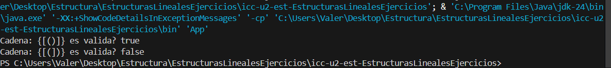
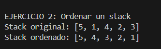

# Práctica de Búsqueda y Ordenamiento de Objetos

## Información General
- **Título:** Estructuras Lineales
- **Asignatura:** Estructura de Datos
- **Carrera:** Computación
- **Estudiante:** Kelly Valeria Guaman Leon
- **Fecha:** 15/12/2025
- **Profesor:** Ing. Pablo Torres

## Estructuras Lineales

## Ejercicio 01: Validación de Signos

### Explicación
Se recibe un `String` compuesto únicamente por los caracteres `() { } [ ]`.  
El objetivo es verificar si la secuencia está balanceada.

### Descripción de la solución
- Se usa un **Stack** para almacenar los símbolos de apertura.
- Cada vez que aparece un símbolo de cierre, se compara con el tope del stack.
- Si coincide, se elimina; si no, la cadena es inválida.
- Al final, si el stack queda vacío, la cadena es válida.

**Ejemplo de salida:**

## Ejercicio 02: Ordenar un Stack
### Explicación
Se recibe un `Stack<Integer>` desordenado.  
El objetivo es ordenar los elementos de manera que el menor quede en el tope.

### Descripción de la solución
- Se usa un Stack auxiliar.
- Se van sacando elementos del stack original y colocándolos en el auxiliar en orden.
- Si el tope del auxiliar es mayor, se regresa al original hasta encontrar la posición correcta.
- Finalmente, se transfiere todo de vuelta al stack original.

**Ejemplo de salida:**

## Ejercicio 03: Palíndromo usando Colas

### Explicación
Se recibe un `String` y se debe verificar si es palíndromo usando solo colas.

### Descripción de la solución
- Se inserta cada carácter en una cola original.
- Se construye otra cola invertida usando una cola auxiliar.
- Se comparan ambas colas elemento por elemento.
- Si todos coinciden es palíndromo.

**Ejemplo de salida:**
